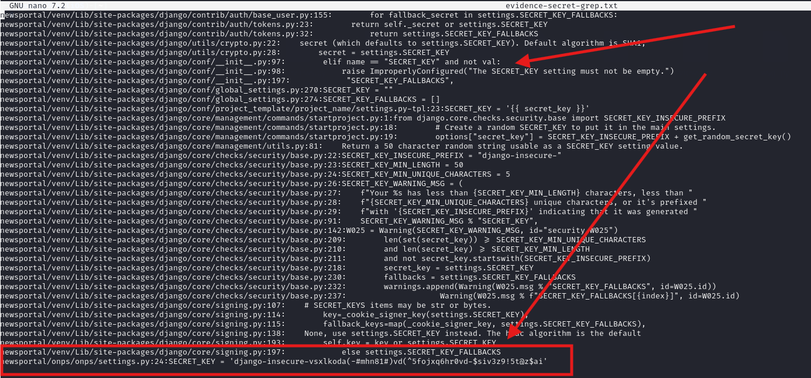
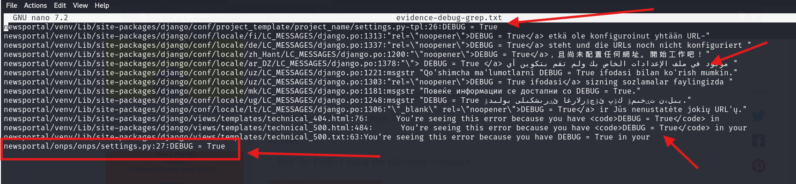

# Security Vulnerability Report: Django DEBUG Mode Enabled in Production

## Vulnerability Overview

**Vulnerability Type**:Insertion of Sensitive Information Into Debugging Code
**Severity**: HIGH  
**CVSS 3.1 Score**: 7.5  
**Discovery Date**: October 20, 2025  
**Affected Component**: News Portal Django Application

**Link:** https://phpgurukul.com/news-portal-using-python-django-and-mysql/#google_vignette

---

## Technical Details

### Location
- **File**: `newsportal/onps/onps/settings.py`
- **Line Number**: 27
- **Component**: Django settings configuration

### Vulnerable Code
```python
DEBUG = True
```

### Description

The Django application has DEBUG mode enabled in the production settings file. Django's DEBUG mode is explicitly intended only for development environments and should never be enabled in production. When enabled, Django generates detailed error pages that expose sensitive information about the application's internal workings.

---

## Vulnerability Classification

### CWE Mappings
- **CWE-209**: Generation of Error Message Containing Sensitive Information
- **CWE-215**: Insertion of Sensitive Information Into Debugging Code
- **CWE-497**: Exposure of Sensitive System Information to an Unauthorized Control Sphere
- **CWE-11**: ASP.NET Misconfiguration: Creating Debug Binary
- **CWE-489**: Active Debug Code

### OWASP Top 10 Mapping
- **A05:2021** - Security Misconfiguration
- **A01:2021** - Broken Access Control (Information Disclosure)

---

## CVSS 3.1 Scoring

**Base Score**: 7.5 (HIGH)  
**Vector String**: `CVSS:3.1/AV:N/AC:L/PR:N/UI:N/S:U/C:H/I:N/A:N`

### Score Breakdown
- **Attack Vector (AV:N)**: Network - Remotely exploitable
- **Attack Complexity (AC:L)**: Low - Simple to trigger
- **Privileges Required (PR:N)**: None - No authentication needed
- **User Interaction (UI:N)**: None - Automated exploitation
- **Scope (S:U)**: Unchanged
- **Confidentiality Impact (C:H)**: High - Extensive information disclosure
- **Integrity Impact (I:N)**: None - Direct integrity impact (indirect via reconnaissance)
- **Availability Impact (A:N)**: None - Direct availability impact

---

## Security Impact

### Information Exposed by DEBUG Mode

When DEBUG=True, Django's error pages reveal:

1. **Application Architecture**
   - Complete stack traces with function names
   - File paths and directory structure
   - Python module imports and dependencies
   - Application logic and code flow

2. **Configuration Details**
   - Environment variables
   - Django settings (filtered, but metadata exposed)
   - Installed applications and middleware
   - Template locations

3. **Database Information**
   - SQL queries executed
   - Database structure hints
   - Query parameters and data
   - ORM model relationships

4. **System Information**
   - Python version
   - Django version
   - Operating system details
   - Server file paths
   - Installed package versions

5. **Request/Response Data**
   - HTTP headers
   - Cookie values
   - POST data
   - Session information

### Attack Scenarios

#### Scenario 1: Reconnaissance for SQL Injection
```
1. Attacker triggers database error by sending malformed input
2. DEBUG page displays full SQL query with parameters
3. Attacker analyzes query structure
4. Attacker identifies SQL injection points
5. Attacker crafts precise SQL injection payload
```

#### Scenario 2: Path Traversal Discovery
```
1. Attacker triggers 404 or file-related error
2. DEBUG page reveals absolute file paths
3. Attacker maps directory structure
4. Attacker identifies sensitive files (settings.py, .env)
5. Attacker attempts path traversal or local file inclusion
```

#### Scenario 3: Version-Specific Exploit Development
```
1. Attacker triggers any error condition
2. DEBUG page shows Django and Python versions
3. Attacker identifies known CVEs for specific versions
4. Attacker deploys version-specific exploits
5. System compromised using public exploits
```

#### Scenario 4: Authentication Bypass Research
```
1. Attacker triggers authentication error
2. Stack trace reveals authentication flow
3. Middleware chain and decorators exposed
4. Attacker identifies authentication logic weaknesses
5. Custom bypass developed based on exposed code
```

#### Scenario 5: API Endpoint Discovery
```
1. Attacker accesses invalid URL patterns
2. DEBUG page shows URL configuration
3. Hidden/undocumented endpoints discovered
4. Admin panels and API endpoints mapped
5. Attack surface significantly expanded
```

---

## Proof of Concept

### Triggering Information Disclosure

#### Method 1: 404 Error Page
```bash
# Access non-existent URL
curl https://target-application.com/nonexistent-page

# Returns detailed 404 debug page with:
# - URL patterns
# - Attempted URL resolution
# - Django version
# - Python version
# - Request metadata
```

#### Method 2: 500 Internal Server Error
```bash
# Trigger application error with invalid input
curl -X POST https://target-application.com/api/endpoint \
  -H "Content-Type: application/json" \
  -d '{"field": "INVALID_VALUE_TYPE"}'

# Returns detailed error page with:
# - Complete stack trace
# - Source code snippets
# - Local variables at each stack frame
# - SQL queries (if database involved)
```

#### Method 3: Database Error
```python
# Send malformed query parameter
import requests

response = requests.get(
    'https://target-application.com/articles',
    params={'id': "'; DROP TABLE--"}
)

# DEBUG page reveals:
# - Exact SQL query attempted
# - Database engine used
# - Table/column names
# - ORM layer details
```

### Example Debug Page Output Analysis

When DEBUG=True, a simple error exposes:

```
Environment:

Request Method: POST
Request URL: https://example.com/api/create
Django Version: 4.2.7
Python Version: 3.11.4
Installed Applications:
['django.contrib.admin',
 'django.contrib.auth',
 'django.contrib.contenttypes',
 ...]
 
Traceback:
File "/app/newsportal/views.py" in create_article
  125.     article = Article.objects.create(**data)
File "/venv/lib/python3.11/site-packages/django/db/models/manager.py"
  85.     return self.get_queryset().create(**kwargs)
  
Exception Type: IntegrityError at /api/create
Exception Value: NOT NULL constraint failed: articles.author_id

Settings:
SECRET_KEY: '********************' [Filtered]
DATABASES: {
    'default': {
        'ENGINE': 'django.db.backends.sqlite3',
        'NAME': '/app/db.sqlite3',
```

---

## Evidence of Vulnerability

### Discovery Method


Automated security scanning revealed:

```bash
grep -nR "DEBUG = True" newsportal > evidence-debug-grep.txt
```

**Result**: Line 27 of `newsportal/onps/onps/settings.py` contains `DEBUG = True`

### Confirmation

Multiple confirmation methods:
1. Direct inspection of settings.py file
2. Triggering 404 error shows Django debug page
3. Application behavior consistent with DEBUG mode
4. No conditional logic for environment-based DEBUG setting

---

## Affected Versions

**To be determined by maintainers**

Likely affects:
- All versions where this configuration exists
- Any production deployment using this settings file
- All environments not using environment-specific settings

---

## Remediation

### Immediate Actions (HIGH Priority - Within 48 Hours)

1. **Disable DEBUG Mode**:
```python
DEBUG = False
```

2. **Configure ALLOWED_HOSTS** (Required when DEBUG=False):
```python
ALLOWED_HOSTS = [
    'yourdomain.com',
    'www.yourdomain.com',
    'api.yourdomain.com',
]
```

3. **Set Up Custom Error Pages**:
```python
# In settings.py
TEMPLATES = [{
    'DIRS': [os.path.join(BASE_DIR, 'templates')],
    # ...
}]

# Create templates/404.html and templates/500.html
```

4. **Configure Proper Logging**:
```python
LOGGING = {
    'version': 1,
    'disable_existing_loggers': False,
    'handlers': {
        'file': {
            'level': 'ERROR',
            'class': 'logging.FileHandler',
            'filename': '/var/log/django/error.log',
        },
    },
    'loggers': {
        'django': {
            'handlers': ['file'],
            'level': 'ERROR',
            'propagate': True,
        },
    },
}
```

### Environment-Based Configuration (Best Practice)

```python
import os

# Use environment variable for DEBUG setting
DEBUG = os.environ.get('DJANGO_DEBUG', 'False') == 'True'

# Only allow DEBUG=True in development
if DEBUG:
    ALLOWED_HOSTS = ['*']  # Only safe in development
else:
    ALLOWED_HOSTS = os.environ.get('ALLOWED_HOSTS', '').split(',')
    
    # Enable production security settings
    SECURE_SSL_REDIRECT = True
    SESSION_COOKIE_SECURE = True
    CSRF_COOKIE_SECURE = True
    SECURE_HSTS_SECONDS = 31536000
    SECURE_HSTS_INCLUDE_SUBDOMAINS = True
    SECURE_HSTS_PRELOAD = True
    X_FRAME_OPTIONS = 'DENY'
    SECURE_CONTENT_TYPE_NOSNIFF = True
    SECURE_BROWSER_XSS_FILTER = True
```

### Multiple Environment Configuration

Create separate settings files:

```python
# settings/base.py - Common settings
DEBUG = False
SECRET_KEY = os.environ.get('DJANGO_SECRET_KEY')

# settings/development.py
from .base import *
DEBUG = True
ALLOWED_HOSTS = ['*']

# settings/production.py
from .base import *
DEBUG = False
ALLOWED_HOSTS = os.environ.get('ALLOWED_HOSTS').split(',')
```

Use environment-specific settings:
```bash
# Development
python manage.py runserver --settings=newsportal.settings.development

# Production
python manage.py runserver --settings=newsportal.settings.production
```

---

## Exploitation Complexity

**Exploitation Difficulty**: TRIVIAL

- No authentication required
- Any HTTP client can trigger
- No rate limiting on error pages
- Immediate information disclosure
- No special tools needed

---

## Detection Methods

### For Security Teams

1. **Automated Detection**:
```bash
# Semgrep rule
semgrep --config p/django

# Custom grep
grep -r "DEBUG = True" settings*.py

# Bandit scan
bandit -r . -ll
```

2. **Manual Testing**:
```bash
# Test for debug page
curl -v https://target.com/nonexistent-url-test-12345

# Check response for:
# - Detailed error information
# - Django version in response
# - Stack traces
# - File paths
```

3. **Monitoring Production**:
```python
# Add middleware to detect DEBUG=True in production
class DebugModeCheck:
    def __init__(self, get_response):
        self.get_response = get_response
        if settings.DEBUG:
            logger.critical("DEBUG MODE ENABLED IN PRODUCTION!")
    
    def __call__(self, request):
        return self.get_response(request)
```

---

## References

### Django Documentation
- [Django DEBUG Setting](https://docs.djangoproject.com/en/stable/ref/settings/#debug)
- [Django Security in Production](https://docs.djangoproject.com/en/stable/howto/deployment/checklist/)
- [Django Error Reporting](https://docs.djangoproject.com/en/stable/howto/error-reporting/)

### Security Standards
- [OWASP Security Misconfiguration](https://owasp.org/Top10/A05_2021-Security_Misconfiguration/)
- [CWE-209: Information Exposure Through Error Messages](https://cwe.mitre.org/data/definitions/209.html)
- [CWE-497: Exposure of Sensitive System Information](https://cwe.mitre.org/data/definitions/497.html)

### Best Practices
- [Django Deployment Checklist](https://docs.djangoproject.com/en/stable/howto/deployment/checklist/)
- [OWASP Secure Configuration Guide](https://cheatsheetseries.owasp.org/cheatsheets/Secure_Configuration_Cheat_Sheet.html)

---

## Real-World Impact Examples

### Case Studies

1. **Information Disclosure Leading to RCE**
   - DEBUG mode exposed Django version 2.1.5
   - Known CVE-2019-6975 (Arbitrary File Read) existed for that version
   - Attacker chained debug info with CVE to achieve RCE

2. **Database Credential Exposure**
   - DEBUG page showed database query with connection string
   - Connection string contained embedded credentials
   - Direct database access obtained

3. **Session Hijacking via Error Page**
   - DEBUG page displayed request headers
   - Session cookie visible in error output
   - Session replay attack successful

---

## Combined Impact with Other Vulnerabilities

**CRITICAL NOTE**: This vulnerability exists alongside CVE #1 (Hardcoded SECRET_KEY)

Combined attack chain:
1. DEBUG=True exposes application structure and Django version
2. Hardcoded SECRET_KEY allows session forgery
3. Debug information reveals admin endpoints
4. Attacker forges admin session using exposed SECRET_KEY
5. Complete application compromise

**Combined CVSS Score**: 9.8 (Critical) - The DEBUG mode significantly reduces the attack complexity for exploiting the SECRET_KEY vulnerability.

---


## Credit

**Researcher**: Nishant Kumar 
**Organization**: Rashtriya Raksha University
**Contact**: nishant.rru@gmail.com

---


### Quick Fix Verification

After remediation, verify with:
```bash
# Should return custom 404 page, not debug page
curl https://target.com/test-nonexistent-url

# Should not reveal Django version or stack traces
```

---

**Report Version**: 1.0  
**Last Updated**: October 20, 2025
